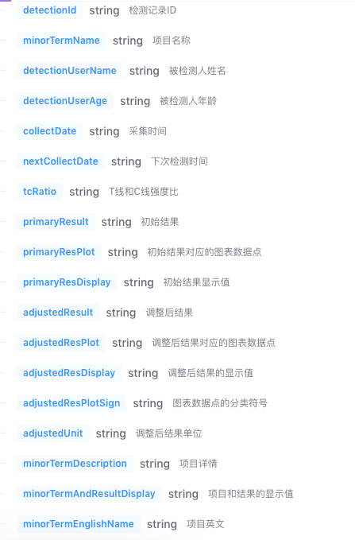
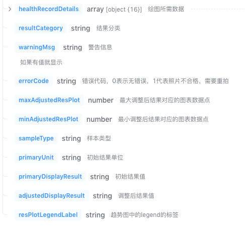
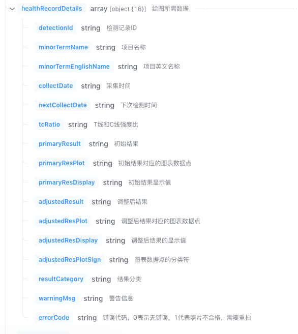

一.根目录下build.gradle

    allprojects {
        repositories {
            maven {
                url 'https://maven.aliyun.com/repository/public'
            }
            maven {
                credentials {
                    username '65d452fb3816152a1f35dc86'
                    password 'aRim)Q)iwEsG'
                }
                url 'https://packages.aliyun.com/maven/repository/2454861-release-yYpULD/'
            }

        }
    }

二.app下build.gradle：

    dependencies {
        implementation "com.biomed.facon.ftc:biomedFaconLibrary-Test:1.0.1"
    }

三.DetectionManager类的api方法说明

    1.init(context:Context,appid:String,appsecret:String)
        初始化sdk，需传值appid和appsecret
    
    2.setUserTag(userTag:String)
        设置三方业务系统登录用户的唯一值
    
    3.clearUserTag()
        清除三方业务系统登录用户的唯一值
    
    4.startDetect(context:Context,call:(String)->Unit):Boolean
        打开检测页面，带返回报告json内容 ；方法return的布尔值，true代表拉起成功，false代表拉起失败（原因：sdk初始化中，或者sdk初始化失败）
    
    5.startDetect(context:Context)
        打开检测页面，出结果之后直接跳转报告详情页面

四.混淆规则

    -dontwarn com.biomed.facon.ftc.sdk.**
    -keep class com.biomed.facon.ftc.sdk.** { *; }

五.报告json字段说明

